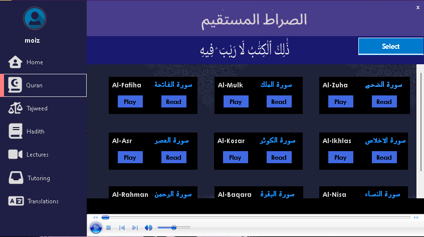
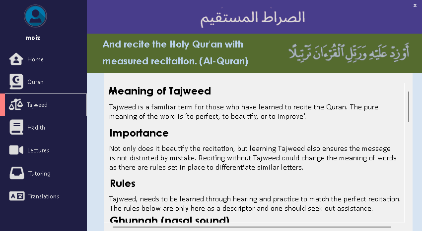
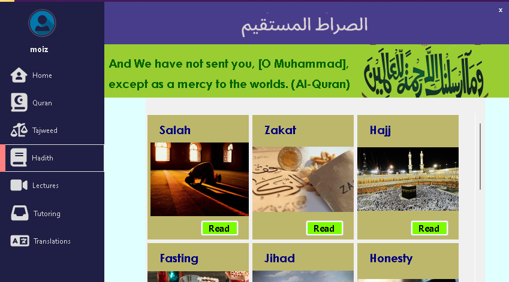
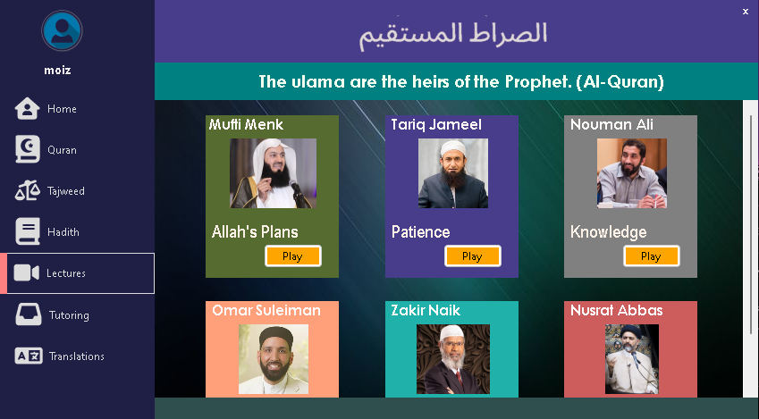
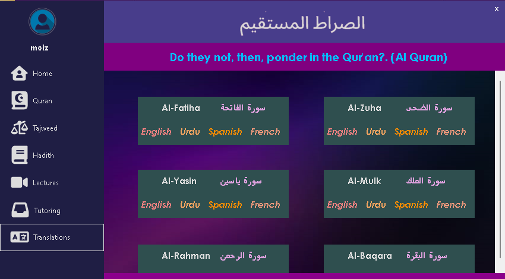
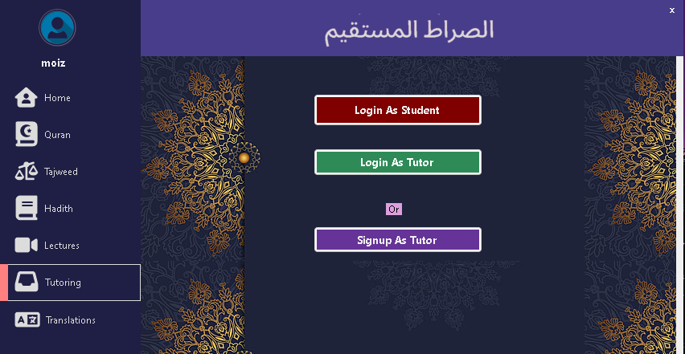

# Desktop Islamic Application

## Overview
This is a comprehensive desktop application developed using C# Windows Forms aimed at enhancing Islamic studies. The application includes features such as Tajweed instruction, embedded YouTube lectures, audio recitations, multiple translations, personalized tutoring and organized Hadiths.

## Features
- **Tajweed Instruction**: Learn the rules and principles of Tajweed for accurate Quranic recitation.
- **Lecture Integration**: Access embedded YouTube videos from renowned scholars covering various Islamic topics.
- **Audio Recitations**: Listen to Quranic recitations from various Qaris.
- **Multiple Translations**: Access multiple Quran translations by linking directly to external websites.
- **Hadith Categorization**: Explore Hadiths categorized based on the life events of the Prophet Muhammad (peace be upon him) and different topics.
- **Personalized Tutoring**: Schedule and receive personalized tutoring sessions with qualified instructors.

## Screens
### Home

### Quran

### Tajweed 

### Hadith 

### Lectures 

### Translations 

### Tutoring 

